# V4 Architecture & SSG Pipeline Proposal

## 1. V4 Vision: The Unified Web Audio Portal

Based on the multi-project ecosystem requirements, **V4** organizes the
repository into four primary structural pillars:

```mermaid
graph TD
  Root["Web Audio Samples Repository (V4)"] --> Portal["dev-portal (Developer Portal)"]
  Root --> Tests["tests (Testing & Benchmarking Suite)"]
  Root --> Projects["projects (Standalone Web Audio Apps)"]
  Root --> Packages["packages (Shared Core Libraries)"]

  Portal --> P1["Interactive Demos & Showcases"]
  Portal --> P2["AudioWorklet Design Patterns"]
  Portal --> P3["API Guides & Documentation"]

  Tests --> T1["latency (Audio Device I/O & Roundtrip Latency)"]
  Tests --> T2["perf (Node-by-Node Performance & Throughput Tests)"]
  Tests --> T3["idl (Web Audio IDL & WPT Spec Verification)"]
  Tests --> T4["smoke (Fuzzing, Edge Cases, Stress & Leak Detection)"]

  Projects --> PR1["rainfly (AudioWorklet Playground IDE)"]
  Projects --> PR2["canopy (Web Audio Inspector & Testbed)"]
  Projects --> PR3["graph-editor (Visual Node Patcher)"]
  Projects --> PR4["synth (Modular / Wavetable Synthesizer)"]

  Packages --> PK1["core (@chrome-web-audio/core: FreeQueue, FIFO, Waveform, Meters)"]
```



To support this model cleanly without build coupling or dependency conflicts,
V4 requires:
1. **A primary SSG engine** for `dev-portal/` (documentation and curated code
   samples).
2. **A workspace/monorepo build orchestrator** that compiles and mounts
   independent `projects/` into their respective subpaths (`/rainfly/`,
   `/canopy/`, etc.) in the final site bundle.
3. **A dedicated testing pillar** under `tests/`:
   - `latency/`: Audio device I/O roundtrip, hardware input/output latency, and
     AudioWorklet render timing.
   - `perf/`: Node-by-node audio processing throughput and stress testing
     (e.g., `BiquadFilterNode`, `DynamicsCompressorNode`, `PannerNode`, `GainNode`,
     `AudioBufferSourceNode`).
   - `idl/`: Web Audio IDL interface validation and Web Platform Tests (WPT)
     spec verification.
   - `smoke/`: Fuzz testing, extreme parameter boundaries, rapid
     connect/disconnect cycles, glitch detection, and memory leak checks.
4. **A typed shared core library** (`packages/core/`) published/scoped as
   `@chrome-web-audio/core`, exposing `FreeQueue`, `FIFO`, `VUMeter`,
   `Waveform`, and common audio helpers.

---

## 2. Projects Hosting & Integration Model (Top-Level vs iframe)

A key architectural requirement is how apps in `projects/` (`rainfly`,
`canopy`, `graph-editor`, `synth`) are deployed and experienced.

### 2.1 First-Class Standalone Applications (No iframe Required)
Each project builds into its own subpath in the output bundle:
- `https://.../rainfly/`
- `https://.../canopy/`
- `https://.../graph-editor/`
- `https://.../synth/`

When a user clicks into a project from the developer portal or landing page,
the browser **navigates directly to that full-window standalone web
application**.

```
_site/ (or dist/)
├── index.html              # Top-level Landing Page / Portal (Astro)
├── dev-portal/             # Developer Guides & Demos (Astro)
├── tests/                  # Latency, Perf, IDL, and Smoke test harnesses
│   ├── latency/            # Device I/O latency benchmarks
│   ├── perf/               # Node throughput & stress tests
│   ├── idl/                # IDL & WPT spec harnesses
│   └── smoke/              # Fuzzing & edge-case validation
├── rainfly/                # Standalone SvelteKit/Vite IDE
│   └── index.html
├── canopy/                 # Standalone Vite Web Audio Inspector
│   └── index.html
├── graph-editor/           # Standalone Visual Node Patcher
│   └── index.html
└── synth/                  # Standalone Synthesizer App
    └── index.html
```

### 2.2 Why Standalone Top-Level Pages are Superior for Web Audio
1. **AudioContext Autoplay & User Gestures**:
   - Browsers enforce strict autoplay policies. Top-level pages handle user
     gesture activation (`audioCtx.resume()`) directly and cleanly without
     cross-frame gesture delegation issues.
2. **SharedArrayBuffer & Cross-Origin Isolation**:
   - High-performance AudioWorklet tools (e.g. `FreeQueue`, WASM workers)
     rely on `SharedArrayBuffer` headers (`COOP`/`COEP`). Iframes require
     explicit `allow="cross-origin-isolated"` and complex header cascades,
     whereas top-level subpaths inherit server headers natively.
3. **Keyboard Shortcuts & Window Focus**:
   - Complex creative apps (Monaco in Rainfly, patcher keybindings in Graph
     Editor, MIDI events) require full keyboard focus. Trapping them in iframes
     causes hotkey collisions with the parent page.
4. **Full Viewport Real Estate**:
   - Audio editors, inspectors, and graph patchers need the entire screen
     width and height.

### 2.3 Optional: Inline Preview Embeds
If a developer documentation page in `dev-portal/` wants to show an interactive
live widget inside a tutorial, it *can* optionally embed the project in an
iframe (e.g., `<iframe src="/rainfly?embed=1"></iframe>`), but the primary,
first-class experience for these tools remains **full-screen standalone apps**.

---

## 3. Adding New Content: Speed & Authoring Workflow Analysis

A critical evaluation factor for V4 is how quick and frictionless it is for
both core maintainers and external open-source contributors to add new
content.

### 3.1 Adding a New Documentation Guide (~30 seconds)
To add a new conceptual guide or API reference:
1. Create a Markdown or MDX file:
   `dev-portal/src/content/docs/audio-worklet-guide.md`
2. Define frontmatter metadata:
   ```markdown
   ---
   title: "AudioWorklet Design Patterns"
   description: "High-performance audio processing with SharedArrayBuffer."
   category: "audio-worklet"
   tags: ["AudioWorklet", "SharedArrayBuffer", "WASM"]
   ---
   ```
- **Instant Automatic Routing**: Astro generates the route
  (`/docs/audio-worklet-guide/`) automatically.
- **Type-Checked Frontmatter**: Astro Content Collections validate all schema
  fields at build time with TypeScript.
- **No Manual Nav Maintenance**: Sidebar navigation dynamically parses the
  directory structure.

---

### 3.2 Adding a New Web Audio Demo (~1 minute)
Unlike full SPA frameworks (React/Next.js/SvelteKit), Astro **does not force
framework lifecycles or component abstractions on simple demos**. You can write
standard vanilla HTML and ES6 JavaScript.

Create `dev-portal/src/pages/demos/biquad-filter.astro`:
```astro
---
import Layout from '../../layouts/Layout.astro';
---

<Layout title="Biquad Filter Demo">
  <h1>Biquad Filter</h1>
  <button id="play-btn">Play Sound</button>

  <script>
    // Pure Vanilla JS - Runs directly in browser window!
    const ctx = new AudioContext();
    document.getElementById('play-btn')?.addEventListener('click', () => {
      const osc = ctx.createOscillator();
      const filter = ctx.createBiquadFilter();
      osc.connect(filter).connect(ctx.destination);
      osc.start();
      osc.stop(ctx.currentTime + 1);
    });
  </script>
</Layout>
```

#### Why Astro is Uniquely Great for Web Audio Demos
- **No SSR `AudioContext` Crashes**: In Next.js or SvelteKit, calling
  `new AudioContext()` at top level will crash the build during server-side
  pre-rendering because Web Audio APIs do not exist in Node/SSR. In Astro,
  `<script>` tags are strictly client-side.
- **Zero Asset Config Overhead**: Drop `.wav` or `.mp3` files in `public/` and
  reference them directly (`/sounds/snare.wav`) without modifying build
  passthrough lists.

---

### 3.3 Adding a New Benchmark or Test (~1 minute)
- **Playwright Test**: Add `tests/perf/biquad-filter.spec.ts`. Playwright
  auto-discovers it in CI.
- **Interactive Test Fixture**: Drop an HTML test fixture in
  `tests/latency/`, `tests/perf/`, `tests/idl/`, or `tests/smoke/`. It is
  immediately available on the local dev server.

---

### 3.4 Adding a New Standalone Project / Tool (~2 minutes)
To bring in an external tool (e.g. Canopy, Synth, Johan's Graph Editor):
```bash
mkdir projects/canopy
cd projects/canopy
npm create vite@latest .
```
- **Total Independence**: The tool has its own `package.json`, Vite config,
  and dependencies. It never risks breaking the dev portal or other tools.
- **Plug-and-Play**: The root monorepo build automatically discovers
  `projects/*` and bundles each to its respective subpath (`dist/canopy/`).

---

### 3.5 Content Authoring Comparison Matrix

| Action | Option A: Astro (Recommended) | Option C: Eleventy 3 (v3) | Option D: SvelteKit Monorepo |
| :--- | :--- | :--- | :--- |
| **New Doc Page** | Drop `.md` (Auto-routed) | Drop `.njk`/`.md`, edit YAML | Create `+page.svelte` |
| **New Audio Demo** | Vanilla HTML + `<script>` | Add `.njk` + add glob | Must wrap in Svelte + SSR guards |
| **New Audio Asset** | Drop in `public/` | Must edit `.eleventy.js` | Drop in `static/` |
| **New Project** | Plug & play `projects/<dir>` | Manual shell scripts & hacks | Coupled router & dependencies |

---

## 4. SSG & Build Engine Options: Detailed Comparison

Below are four viable approaches for the primary portal and build pipeline.

---

### Option A (Recommended): Astro + Monorepo Workspaces

**How it works**:
- **`dev-portal/`**: Built using **Astro** (static output mode). Astro
  generates zero-JS HTML by default, features native Markdown/MDX support, and
  allows embedding interactive UI components (Vanilla JS, Svelte, React, Web
  Components) seamlessly inside demo pages.
- **`projects/`**: Each tool (`rainfly`, `canopy`, `graph-editor`, `synth`) is
  an independent package in `projects/`, built with Vite and mounted directly
  to `_site/<project_name>/`.
- **`tests/`**: Dedicated suites for device I/O latency (`tests/latency/`),
  node throughput benchmarking (`tests/perf/`), IDL verification
  (`tests/idl/`), and fuzzing/edge-cases (`tests/smoke/`), orchestrated with
  Playwright and CI.
- **Workspaces**: Managed via `npm` or `pnpm` workspaces with a single root
  `npm run build` that builds `packages/core`, all `projects/`, and
  `dev-portal/`.

```
├── dev-portal/           # Astro SSG (Developer docs & demos)
├── projects/             # Standalone Vite / Svelte apps
│   ├── canopy/
│   ├── graph-editor/
│   ├── rainfly/
│   └── synth/
├── packages/
│   └── core/             # Typed Shared Audio Lib (@chrome-web-audio/core)
└── tests/                # Testing & benchmarking harnesses
    ├── idl/              # Web Audio IDL & WPT spec tests
    ├── latency/          # Device I/O & roundtrip latency
    ├── perf/             # Per-node throughput & stress tests
    └── smoke/            # Fuzzing & edge-case validation
```

#### Pros
- **Zero-JS by Default**: Extremely fast page loads and lightweight static
  HTML for developer docs and simple demos.
- **Easiest Content Authoring**: Writing standard HTML/JS samples requires no
  framework gymnastics or SSR workarounds.
- **Built-in Content Collections**: Native TypeScript type-safety for frontmatter
  and YAML data schemas.
- **Vite-Native**: Shared tooling, instant HMR, and modern asset handling
  across both the portal and subprojects.

#### Cons
- Requires introducing Astro as the SSG layer (replacing Eleventy).

---

### Option B: Vite Multi-Page App (MPA) + VitePress / Starlight

**How it works**:
- **`dev-portal/`**: Use **VitePress** or **Starlight** for structured
  documentation, coupled with native Vite MPA multi-page entrypoints for
  individual demo pages.
- **`projects/`**: Standard Vite apps in subdirectories, linked via Vite's
  multi-root or workspace build.

#### Pros
- Unified Vite ecosystem for 100% of the repository.
- Single build engine and configuration syntax across everything.
- Instant dev server startup and standard modern ESM loading.

#### Cons
- VitePress is Vue-centric; embedding non-Vue complex interactive demos in docs
  can require extra boilerplate.
- Managing dozens of standalone vanilla JS demo HTML pages as distinct MPA
  entries in Vite can require custom glob rollup configuration.

---

### Option C: Modernized Eleventy v3 + Vite Plugin + Workspaces

**How it works**:
- Keep **Eleventy v3** for `dev-portal/`, but integrate
  `@11ty/eleventy-plugin-vite` to replace the fragmented Tailwind CLI and
  manual passthrough copy rules with a unified Vite bundler.
- Formalize `projects/` (`rainfly`, `canopy`, etc.) into `npm workspaces` with
  orchestrated scripts (`npm run build:all`).

#### Pros
- Minimal disruption to existing `.njk` templates and current site layout.
- Familiar architecture for existing maintainers.
- Low migration risk for existing documentation content.

#### Cons
- Retains Eleventy's multi-engine complexity (Nunjucks + Liquid + Markdown).
- Integrating Vite with Eleventy can be finicky with complex audio asset paths,
  AudioWorklet module loading, and SharedArrayBuffer headers.
- Eleventy lacks built-in TypeScript frontmatter validation.

---

### Option D: Unified SvelteKit / SPA Monorepo

**How it works**:
- Migrate the entire repository into a **SvelteKit** monorepo (aligning with
  Rainfly's existing SvelteKit stack) using static adapter export
  (`@sveltejs/adapter-static`).

#### Pros
- 100% stack consistency across Rainfly, other projects, and the portal.
- Rich component reusability between the portal UI and tools like Rainfly,
  Canopy, and Synth.
- Excellent TypeScript integration and routing out of the box.

#### Cons
- **Hardest for Simple Demos**: All audio demos must be wrapped in Svelte
  components with SSR guards (e.g. `if (browser) new AudioContext()`).
- Higher barrier to entry for external Web Audio contributors who just want to
  submit a plain vanilla JS audio sample.

---

## 5. Comparison Matrix

| Criteria | Option A: Astro + Workspaces | Option B: Vite MPA / Docs | Option C: Eleventy 3 + Vite | Option D: SvelteKit Monorepo |
| :--- | :--- | :--- | :--- | :--- |
| **Best Fit for Portal Vision** | ⭐⭐⭐⭐⭐ **Highest** | ⭐⭐⭐⭐ High | ⭐⭐⭐ Moderate | ⭐⭐⭐ Moderate |
| **Ease of Adding New Samples** | ⭐⭐⭐⭐⭐ **Easiest** (Vanilla JS / MDX) | ⭐⭐⭐⭐ Good | ⭐⭐⭐ Moderate (Manual copy) | ⭐⭐ Hard (SSR guards) |
| **Ease of Adding New Projects** | ⭐⭐⭐⭐⭐ **Plug & Play** | ⭐⭐⭐⭐ Good | ⭐⭐⭐ Moderate | ⭐⭐⭐ Coupled |
| **Subproject Independence** | ⭐⭐⭐⭐⭐ Complete | ⭐⭐⭐⭐ High | ⭐⭐⭐⭐ High | ⭐⭐⭐ Coupled |
| **Modern Asset / Vite Pipeline** | ⭐⭐⭐⭐⭐ Native | ⭐⭐⭐⭐⭐ Native | ⭐⭐⭐ Plugin-based | ⭐⭐⭐⭐⭐ Native |
| **Zero-JS Static Performance** | ⭐⭐⭐⭐⭐ Native | ⭐⭐⭐⭐ High | ⭐⭐⭐⭐⭐ High | ⭐⭐⭐ Client hydrate |
| **Migration Effort** | ⭐⭐⭐ Moderate | ⭐⭐⭐ Moderate | ⭐⭐ Low | ⭐⭐⭐⭐ High |

---

## 6. Proposed Monorepo Directory Architecture

```
web-audio-samples/
├── .github/workflows/          # CI, Playwright, Deployment
├── _agents/                    # JetSki / Antigravity rules, skills, agents
├── migration/                  # V4 planning and research notes
│
├── dev-portal/                 # Developer-facing SSG Portal (Astro)
│   ├── src/
│   │   ├── content/            # MDX/Markdown docs & sample descriptions
│   │   ├── demos/              # Curated interactive Web Audio demos
│   │   ├── audio-worklet/      # AudioWorklet pattern guides & code
│   │   └── components/         # Portal UI elements (headers, waveforms)
│   └── astro.config.mjs
│
├── tests/                      # Testing & Benchmarking Suite
│   ├── latency/                # Audio device I/O & roundtrip latency
│   ├── perf/                   # Per-node throughput & stress tests
│   ├── idl/                    # Web Audio IDL & WPT spec validation
│   └── smoke/                  # Fuzzing, extreme parameters, edge cases
│
├── projects/                   # Standalone Web Audio Apps (Top-Level SPAs)
│   ├── rainfly/                # In-browser AudioWorklet IDE
│   ├── canopy/                 # Web Audio graph & node inspector
│   ├── graph-editor/           # Visual Web Audio node patcher
│   └── synth/                  # Advanced synthesizer application
│
├── packages/
│   └── core/                   # Shared TypeScript Web Audio Library
│       ├── src/
│       │   ├── free-queue/     # Lock-free ring buffer (SAB / WASM)
│       │   ├── fifo/           # Audio buffer FIFO
│       │   ├── meters/         # VUMeter, PeakMeter
│       │   └── waveform/       # Modern Waveform visualizer
│       └── package.json        # Published as @chrome-web-audio/core
│
└── package.json                # Root workspace orchestration
```

---

## 7. Key Recommendations for V4

1. **Adopt Option A (Astro + Workspaces)**:
   - Clean separation between content/docs and complex standalone web apps.
   - Allows external contributors to write vanilla ES6 JS for samples while
     letting standalone projects in `projects/` innovate independently.
2. **Projects as First-Class Top-Level SPAs**:
   - Build apps in `projects/` directly to their own root subpaths (`/rainfly/`,
     `/canopy/`, `/graph-editor/`) so they run in full-window context with
     native `SharedArrayBuffer` isolation and keyboard shortcut handling.
3. **Structured Testing Suite under `tests/`**:
   - `tests/latency/`: Device I/O and roundtrip latency measurement.
   - `tests/perf/`: Node-by-node audio throughput and stress benchmarks.
   - `tests/idl/`: Web Audio IDL compliance and WPT spec test suite.
   - `tests/smoke/`: Fuzzing, extreme boundary cases, rapid graph
     reconnections, glitch checks, and leak detection.
4. **Standardize Core Shared Utilities**:
   - Package `FreeQueue`, `FIFO`, `VUMeter`, and `Waveform` under
     `@chrome-web-audio/core` with TypeScript types (`.d.ts`).
5. **Automate Monorepo Build Orchestration**:
   - The root build script compiles `packages/core`, runs `projects/*` builds,
     generates the `dev-portal`, and outputs a unified deployment folder.
