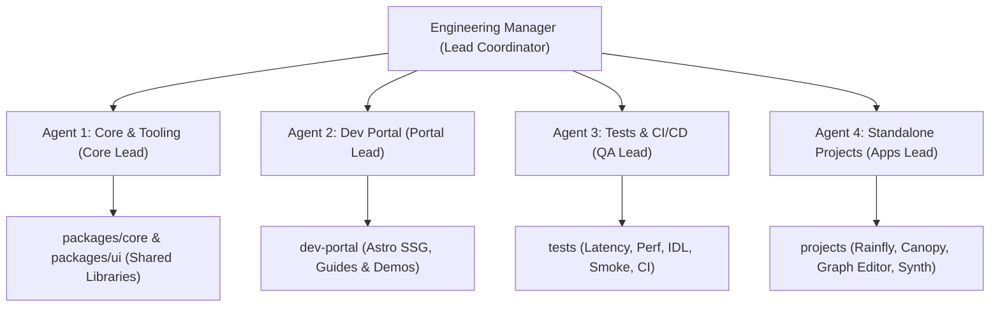

# V4 Migration: Engineering Management & Execution Plan

## 1. Executive Summary & Team Structure

As the Engineering Manager for the **v4 Migration Project**, the objective is
to transition `web-audio-samples` from the legacy v3 Eleventy architecture to
the modern 4-pillar monorepo (`dev-portal`, `tests`, `projects`,
`packages/core`, and `packages/ui`) with zero regressions, complete type
safety, and seamless subproject autonomy.

We will deploy a specialized team of **4 Autonomous Subagents**, coordinated
through well-defined dependency gates and workstreams:

---

## 2. Subagent Role Definitions & Ownership

### Agent 1: Core Library & Infrastructure Lead (`@agent-core`)
- **Primary Domain**: `packages/core/`, `packages/ui/`, and monorepo tooling.
- **Key Responsibilities**:
  - **`packages/core`** (`@chrome-web-audio/core`): Headless audio DSP,
    lock-free ring buffer (`FreeQueue`), audio buffer FIFO (`FIFO`), and
    DSP/sequencer math with TypeScript types (Worker/AudioWorklet safe).
  - **`packages/ui`** (`@chrome-web-audio/ui`): Reusable audio UI visualizers
    and Web Components (`Waveform`, `VUMeter`, `AudioKnob`, `AudioGraph`)
    derived from Spiral and V3 libraries.
  - Setup bundling with `tsup`/Vite emitting ESM and `.d.ts` declarations.
  - Configure root `package.json` workspaces and orchestration scripts.

### Agent 2: Developer Portal Lead (`@agent-portal`)
- **Primary Domain**: `dev-portal/` (Astro SSG + Tailwind CSS v4).
- **Key Responsibilities**:
  - Build responsive base layouts, navigation, and landing page.
  - Define Astro Content Collections schemas for documentation and guides.
  - Migrate all 15 AudioWorklet samples (`basic/`, `design-pattern/`, etc.).
  - Consolidate curated demos and move static audio files to `public/sounds/`.
  - Ingest Stanford Music 220A course modules under `dev-portal/learn/`.

### Agent 3: Testing & Quality Assurance Lead (`@agent-qa`)
- **Primary Domain**: `tests/` and GitHub Actions CI pipelines.
- **Key Responsibilities**:
  - Migrate device latency harnesses to `tests/latency/`.
  - Reorganize per-node benchmarks into `tests/perf/`.
  - Implement IDL compliance checks in `tests/idl/`.
  - Construct fuzzing and boundary stress tests in `tests/smoke/`.
  - Configure Playwright multi-browser test runners and GitHub Actions.

### Agent 4: Standalone Projects Lead (`@agent-projects`)
- **Primary Domain**: `projects/` (Top-Level Web Audio SPAs).
- **Key Responsibilities**:
  - Migrate Rainfly into `projects/rainfly/` (modernize SvelteKit/Vite).
  - Scaffold and integrate Canopy (`projects/canopy/`).
  - Scaffold and integrate Johan's Graph Editor (`projects/graph-editor/`).
  - Consolidate wavetable synthesis tools into `projects/synth/`.
  - Ensure independent Vite builds mount cleanly to `dist/<project>/`.

---

## 3. RACI Matrix (Responsibility Assignment)

| Deliverable | @agent-core | @agent-portal | @agent-qa | @agent-projects |
| :--- | :---: | :---: | :---: | :---: |
| **Monorepo Workspaces & Root Build** | **Accountable** | Consulted | Consulted | Consulted |
| **`@chrome-web-audio/core` (Headless TS)** | **Accountable** | Informed | Informed | Informed |
| **`@chrome-web-audio/ui` (Web Components)** | **Accountable** | Consulted | Informed | Consulted |
| **`dev-portal` (Astro SSG & Demos)** | Informed | **Accountable** | Informed | Consulted |
| **AudioWorklet & Music 220A Guides** | Informed | **Accountable** | Informed | Informed |
| **Latency / Perf / Smoke Harnesses** | Consulted | Informed | **Accountable** | Informed |
| **Playwright CI Automation** | Informed | Informed | **Accountable** | Informed |
| **Rainfly SvelteKit Modernization** | Informed | Informed | Informed | **Accountable** |
| **Canopy / Graph Editor Integration** | Informed | Consulted | Informed | **Accountable** |

---

## 4. Timeline & Sprints (10-Day Migration Runway)

```mermaid
gantt
  title V4 Monorepo Migration Timeline
  dateFormat  X
  axisFormat  Day %d

  section Sprint 0: Foundation
  Monorepo Workspaces & Root Config   :a1_0, 0, 2d
  packages/core (FreeQueue & FIFO)    :a1_1, 0, 2d
  packages/ui (Waveform & VUMeter)    :a1_2, 1, 3d

  section Sprint 1: Parallel Migration
  Core & UI Unit Tests & Bundling     :a1_3, 2, 4d
  Dev Portal Shell & Content Schemas  :a2_0, 2, 5d
  AudioWorklet & Music 220A Porting   :a2_1, 3, 6d
  Tests Restructuring (Latency/Perf)  :a3_0, 2, 5d
  Rainfly Subproject Migration        :a4_0, 2, 5d

  section Sprint 2: Integration & QA
  Smoke / Fuzzing & IDL Test Suite    :a3_1, 5, 8d
  Playwright CI Automation Workflows  :a3_2, 6, 8d
  Canopy & Graph Editor Scaffolding   :a4_1, 5, 8d
  Curated Demos Porting               :a2_2, 5, 8d

  section Sprint 3: Cutover & Release
  End-to-End Verification & Staging  :crit, 8, 10d
  Legacy src/ Archival & Merge       :crit, 9, 10d
```

---

## 5. Phase-by-Phase Detailed Breakdown

### Sprint 0: Foundation & Package Extraction (Days 1–2)
- **Goal**: Establish workspace boundaries and publish core + UI packages.
- **Dependencies**: None.
- **Deliverables**:
  - Root `package.json` with npm/pnpm workspaces.
  - `packages/core/`: Headless TypeScript interfaces for `FreeQueue`, `FIFO`,
    and audio buffer helpers.
  - `packages/ui/`: TypeScript visualizers and Web Components for `Waveform`,
    `VUMeter`, and audio controls.

### Sprint 1: Parallel Development Streams (Days 3–5)
- **Goal**: Build out the primary bodies of each pillar simultaneously.
- **Parallel Work**:
  - `@agent-core`: Finalize bundling and Vitest suites for `core` and `ui`.
  - `@agent-portal`: Build Astro portal layouts, navigation, and port 15
    AudioWorklet design pattern pages.
  - `@agent-qa`: Move node benchmarks to `tests/perf/` and I/O latency tests to
    `tests/latency/`.
  - `@agent-projects`: Move `src/rainfly/` to `projects/rainfly/` and establish
    independent Vite build output.

### Sprint 2: Tooling Integration & Advanced Tests (Days 6–8)
- **Goal**: Integrate subprojects, finalize test suites, and link portal.
- **Parallel Work**:
  - `@agent-portal`: Migrate remaining curated demos (`mld-drum-sampler`,
    `shiny-drum-machine`, `dj`, `visualizer`) and Music 220A modules.
  - `@agent-qa`: Implement `tests/smoke/` fuzzing suite, `tests/idl/`, and
    re-enable automated GitHub Actions Playwright matrix.
  - `@agent-projects`: Scaffold `projects/canopy/` and
    `projects/graph-editor/`.

### Sprint 3: Verification, Staging & Cutover (Days 9–10)
- **Goal**: Full automated verification, performance validation, and release.
- **Verification Gates**:
  1. `npm run build` runs cleanly across all workspaces from root.
  2. All Playwright tests pass on Chromium, Firefox, and WebKit.
  3. Zero broken links or missing static audio assets in `dev-portal`.
  4. Legacy `src/` directory safely removed/archived.
  5. PR created to merge `v4-dev` into `main`.

---

## 6. Risk Management & Mitigations

| Identified Risk | Severity | Mitigation Strategy |
| :--- | :---: | :--- |
| **`AudioWorklet` & `SAB` COOP/COEP Headers** | High | Configure dev server and GitHub Pages preview with explicit cross-origin isolation headers. |
| **Headless vs UI Package Coupling** | Medium | Enforce zero DOM/Canvas dependencies in `packages/core` to guarantee AudioWorklet thread safety. |
| **Rainfly Dependency Desync** | Medium | Isolate Rainfly's SvelteKit dependencies inside `projects/rainfly/` via workspace boundaries. |
| **Audio File Asset 404s** | Medium | Consolidate all audio samples into `dev-portal/public/sounds/` with automated link-checking tests. |
| **Playwright Audio Flakiness in CI** | Low | Use headless Chromium with `--autoplay-policy=no-user-gesture-required` and audio stubbing fixtures. |
