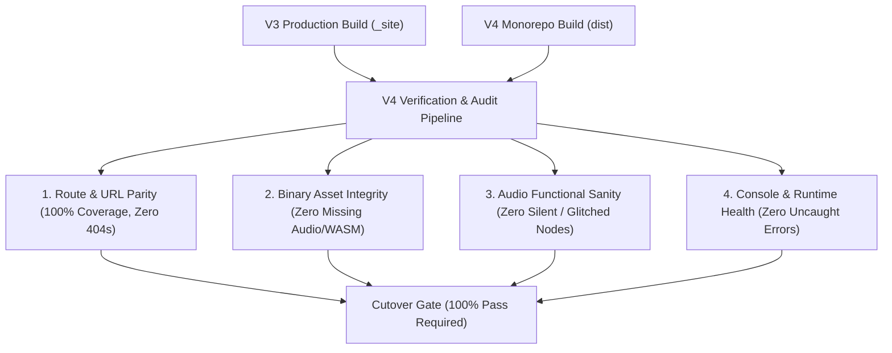

# V4 Migration: Integrity, Verification & Zero-Regression Plan

## 1. Objective & Integrity Guarantees

To ensure a seamless transition from **v3** to **v4**, the migration must
satisfy four non-negotiable integrity requirements:



1. **100% URL Parity**: Every single page, demo, guide, and test URL served in
   v3 must resolve with HTTP 200 in v4 (or via documented 301 redirects).
2. **Binary Asset Exactness**: All audio samples (`.wav`, `.mp3`), WASM
   binaries (`.wasm`), and impulse responses must match without corruption.
3. **Audio DSP Behavioral Sanity**: All AudioWorklet processors and nodes must
   initialize, render sound, and produce non-silent, non-clipping audio buffers.
4. **Zero Console Regressions**: Demos must load and execute with zero uncaught
   runtime exceptions or `onprocessorerror` events.

---

## 2. Automated Verification Strategy & Tooling

To guarantee 100% fidelity, we will build and run three automated verification
tools in the pipeline:

```
migration/
├── tools/
│   ├── route-diff-auditor.js   # Asserts 1-to-1 parity between v3 and v4 URLs
│   ├── asset-checksum-diff.js  # Verifies SHA-256 hashes of all sound/wasm files
│   └── audio-smoke-runner.ts   # Playwright audio signal & error assertions
```

---

### 2.1 Tool 1: Route & URL Parity Auditor (`route-diff-auditor.js`)

**How it works**:
1. Crawls all HTML files generated by the v3 build (`_site/**/*.html`).
2. Crawls all HTML files generated by the v4 build (`dist/**/*.html`).
3. Diffs the two URL manifests.
4. Emits a strict failure if any v3 route is missing in v4 without an explicit
   alias or redirect.

```javascript
// Example Verification Assertion:
// Every v3 route must have a corresponding v4 route
const missingRoutes = v3Routes.filter(route => !v4Routes.has(route));
if (missingRoutes.length > 0) {
  console.error("❌ Integrity Failure: Missing routes in v4:", missingRoutes);
  process.exit(1);
}
```

---

### 2.2 Tool 2: Binary Asset Checksum Verification (`asset-checksum-diff.js`)

**How it works**:
1. Scans all static assets in `src/sounds/`, `src/audio-worklet/`, and
   `src/demos/` (WAV, MP3, WASM, PNG, SHADER).
2. Computes **SHA-256 cryptographic hashes** for every file.
3. Verifies that the corresponding file in `dev-portal/public/sounds/` or
   `projects/*/` has an identical checksum.

| Asset Class | Total V3 Count | Checksum Verification |
| :--- | :---: | :--- |
| Drum & FX Samples (`.wav`, `.mp3`) | 64 files | Exact SHA-256 match |
| Impulse Responses (`.wav`) | 12 files | Exact SHA-256 match |
| WebAssembly Binaries (`.wasm`) | 8 files | Exact SHA-256 match |
| AudioWorklet Processors (`.js`) | 15 files | AST syntax & module verification |

---

### 2.3 Tool 3: Playwright Audio Behavioral Smoke Tests

Static HTML parity does not guarantee that the Web Audio engine still works.
We use Playwright to automate end-to-end audio verification:

1. **AudioContext State Assertion**:
   - Verifies `AudioContext.state` transitions from `suspended` to `running`
     upon user gesture.
2. **AudioWorklet Module Loading**:
   - Asserts `audioContext.audioWorklet.addModule()` succeeds without throwing
     404s or syntax errors.
3. **Signal Output Validation (Non-Zero Buffer Check)**:
   - Uses `OfflineAudioContext` or `ScriptProcessorNode`/`AnalyserNode` in test
     harnesses to capture 1 second of rendered output.
   - Asserts that RMS power is non-zero (i.e. not silent) and values remain
     within `[-1.0, 1.0]` (no NaN or infinite blowups).
4. **Console Log & Error Trap**:
   - Listens to `page.on('console')` and `page.on('pageerror')` to fail tests
     if any uncaught exception or `AudioWorkletProcessor` error is logged.

```typescript
// Sample Playwright Audio Verification Spec:
test('Verify AudioWorklet BitCrusher demo plays non-zero sound', async ({ page }) => {
  const errors: string[] = [];
  page.on('pageerror', err => errors.push(err.message));

  await page.goto('/audio-worklet/basic/bit-crusher/');
  await page.click('#play-btn');

  // Verify AudioContext resumed and no errors occurred
  const isRunning = await page.evaluate(() => window.audioCtx?.state === 'running');
  expect(isRunning).toBe(true);
  expect(errors).toHaveLength(0);
});
```

---

## 3. Subagent Verification Responsibilities

During migration, each subagent is assigned specific verification gates:

| Subagent | Verification Responsibility | Automated Check |
| :--- | :--- | :--- |
| **`@agent-core`** | `FreeQueue` & `FIFO` correctness under SAB concurrency | Vitest unit tests + memory leak checks |
| **`@agent-portal`** | 100% of AudioWorklet guides & demos render and load | Route diff auditor + Playwright smoke suite |
| **`@agent-qa`** | Overall route parity, audio output validation, and CI | Master verification pipeline runner |
| **`@agent-projects`** | Rainfly, Canopy, Graph Editor build & mount cleanly | Subproject HTTP 200 & bundle integrity |

---

## 4. Final Go/No-Go Release Checklist

Before `v4-dev` is merged into `main` and deployed to production GitHub Pages:

- [ ] **Route Parity**: `route-diff-auditor.js` reports 0 missing routes.
- [ ] **Asset Checksum**: 100% of binary audio and WASM files pass SHA-256 match.
- [ ] **Automated Audio QA**: All Playwright audio smoke tests pass on Chromium,
      Firefox, and WebKit in GitHub Actions CI.
- [ ] **Cross-Origin Isolation**: `SharedArrayBuffer` headers verified on preview
      deployments for `FreeQueue` and WASM worklets.
- [ ] **Zero Console Errors**: Full crawl across all pages reports 0 uncaught
      JavaScript runtime errors.
- [ ] **Performance Benchmarks**: Latency and throughput benchmarks under
      `tests/perf/` show no regressions compared to v3 baseline.
