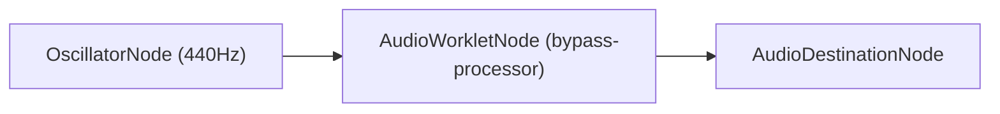

A simple `AudioWorkletNode` that bypasses the incoming audio stream to its
output. The sound source is a sine oscillator at 440 Hz.

For more information, see the [Chrome Developers Article][article-link].

[article-link]: https://developer.chrome.com/blog/audio-worklet/

<div
  class="my-6 p-6 rounded-xl border border-slate-200 bg-slate-50/60
    shadow-sm space-y-4"
>
  <div class="flex items-center justify-between">
    <div>
      <h3 class="text-sm font-semibold text-slate-900">Interactive Demo</h3>
      <p class="text-xs text-slate-500">
        Click START to run the bypass worklet node.
      </p>
    </div>
    <button
      id="button-start"
      class="px-5 py-2 rounded-lg bg-blue-600 hover:bg-blue-700 text-white
        text-xs font-semibold tracking-wide transition shadow-sm
        cursor-pointer disabled:opacity-50 disabled:cursor-not-allowed"
    >
      START
    </button>
  </div>
</div>

<script
  type="module"
  src="/audio-worklet/basic/hello-audio-worklet/main.js"
></script>

## Overview

The `AudioWorklet` infrastructure allows developers to implement custom audio
processing scripts that run off the main thread in the audio rendering thread.

In this demo, the audio graph consists of:
1. **`OscillatorNode`**: Generates a standard 440 Hz sine wave tone.
2. **`AudioWorkletNode` (`bypass-processor`)**: Forwards input channels directly
   to output channels.
3. **`AudioDestinationNode`**: Browser audio output (speakers / headphones).



## AudioWorklet Processor

The processor script runs on the audio rendering thread:

```javascript
// bypass-processor.js
class BypassProcessor extends AudioWorkletProcessor {
  process(inputs, outputs) {
    const input = inputs[0];
    const output = outputs[0];

    for (let channel = 0; channel < output.length; ++channel) {
      output[channel].set(input[channel]);
    }

    return true;
  }
}

registerProcessor('bypass-processor', BypassProcessor);
```

## Main Thread Setup

On the main thread, the processor module is loaded asynchronously using
`audioContext.audioWorklet.addModule()`, and then connected into the Web Audio
graph:

```javascript
// main.js
const audioContext = new AudioContext();

// 1. Load the processor script into the audio worklet thread
await audioContext.audioWorklet.addModule('bypass-processor.js');

// 2. Instantiate the custom AudioWorkletNode
const bypasser = new AudioWorkletNode(audioContext, 'bypass-processor');

// 3. Connect nodes: Oscillator -> BypassWorklet -> Destination
const oscillator = new OscillatorNode(audioContext);
oscillator.connect(bypasser).connect(audioContext.destination);
oscillator.start();
```
